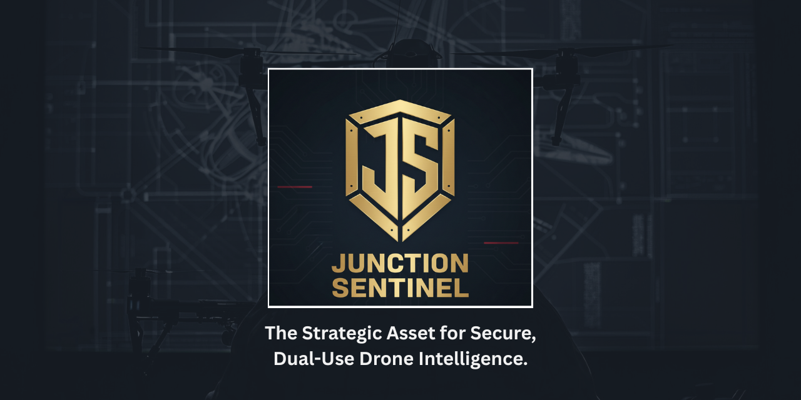
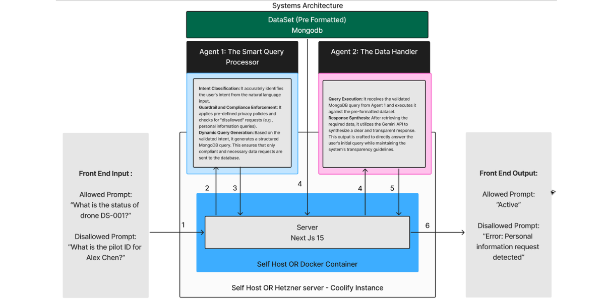
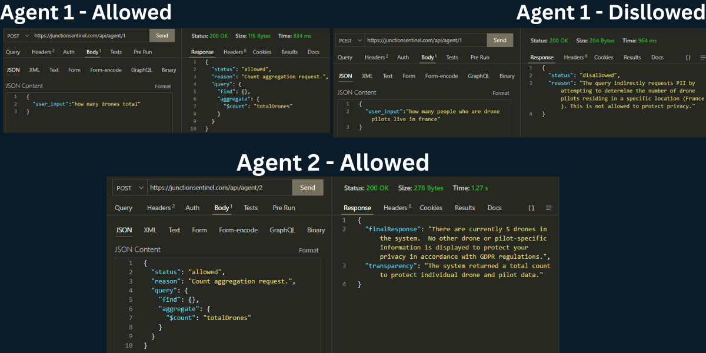

# Junction Sentinel

<p align="center">
   
   
   
   
   
   
</p>



## Project Overview

**Junction Sentinel** is a multi-agent cybersecurity platform designed to secure drone intelligence data.  
Developed for the **DIANA (NATO Defence Innovation Accelerator)** challenge, it addresses two critical domains:

- Sensing & Surveillance
- Information & Data Security

The system is built on **Privacy-by-Design** principles, ensuring compliance, data minimization, and full auditability.  
It enables **real-time, privacy-preserving queries** on sensitive data with safeguards against leakage and misuse.

---

## System Architecture



The architecture is composed of **modular, cooperative agents**. This design ensures resilience, explainability, and transparency, compared to a monolithic system.

### Key Agents

1. **Query Interpreter**
   - Analyzes user intent from natural language input.
   - Rejects disallowed or non-compliant queries.

2. **Compliance Checker**
   - Enforces GDPR and NATO Data Strategy guardrails.
   - Blocks risky queries before execution.

3. **Data Transformer**
   - Applies anonymization, summarization, or pseudonymization.
   - Ensures strict data minimization.

4. **LLM + RAG Engine**
   - Uses Google Gemini with Retrieval-Augmented Generation for context.
   - Secured with Prompt Sanitization and Differential Privacy.

5. **Response & Audit Layer**
   - Returns clear responses.
   - Maintains a full audit trail of all data handling.

---

## Agent Workflows



### Agent 1: Smart Query Processor

- Intent classification for natural language queries
- Policy guardrails and compliance checks
- Generates structured MongoDB queries

### Agent 2: Data Handler

- Executes only validated MongoDB queries
- Synthesizes compliant responses with Gemini API

### API Endpoints

```http
POST /api/agent/1       → Intent & compliance checks
POST /api/agent/2       → Data handler & synthesis
POST /api/agent/query  → End-to-end query workflow
```

## Technology Stack

| Layer    | Technology                                                |
| -------- | --------------------------------------------------------- |
| Frontend | Next.js, React, Material UI                               |
| Backend  | Node.js (Express)                                         |
| Database | MongoDB                                                   |
| AI / ML  | Google Gemini, Retrieval-Augmented Generation             |
| Security | GDPR/NATO guardrails, Differential Privacy, Audit Logging |

---

## Key Features

- **Privacy-by-Design**: Compliance and data protection built into every step.
- **Auditability**: Complete records of data access and transformations.
- **Ease of Use**: Natural language queries automatically processed within privacy guardrails.

## Quickstart Guide

Follow these steps to run the Junction Sentinel prototype locally.

### 1. Clone the Repository

```bash
git clone https://github.com/Curtis-Thomas/oulues-hackahton-junction-boxers.git
cd oulues-hackahton-junction-boxers
```

### 2. Install Dependencies

```
npm install
```

### 3. Configure Environment Variables

Create a file named .env.local in the root directory and add the following:

```
# Google Gemini API
GEMINI_API_KEY=

# API URL
NEXT_PUBLIC_API_URL=http://localhost:3000

# MongoDB Connection
MONGODB_URI=

# Application URL
APP_BASE_URL=http://localhost:3000

# Auth0 Configuration
AUTH0_CLIENT_ID=
AUTH0_CLIENT_SECRET=
AUTH0_DOMAIN=
AUTH0_SECRET=
```

### 4. Example Dataset

#### Single drone data

```
{
    "_id": {
      "$oid": "65163625f3851b32d3a3c26a"
    },
    "droneId": "DS-001",
    "model": "Falcon 900",
    "status": "Active",
    "location": {
      "latitude": 40.7128,
      "longitude": -74.006,
      "lastUpdated": {
        "$date": "2025-09-19T10:00:00Z"
      }
    },
    "pilot": {
      "pilotId": "P-101",
      "firstName": "Alex",
      "lastName": "Chen",
      "licenseNumber": "LN-987654321",
      "contact": {
        "email": "alex.chen@example.com",
        "phone": "+1-202-555-0145"
      }
    },
    "flightHistory": [
      {
        "flightId": "F-501",
        "date": {
          "$date": "2025-09-18T14:30:00Z"
        },
        "durationMinutes": 45,
        "purpose": "Surveillance",
        "payload": "High-res Camera"
      }
    ],
    "telemetry": {
      "batteryLevel": 85,
      "altitudeMeters": 150,
      "speedMps": 20
    },
    "maintenance": {
      "lastServiceDate": {
        "$date": "2025-09-10T00:00:00Z"
      },
      "nextServiceDate": {
        "$date": "2025-10-10T00:00:00Z"
      },
      "serviceLog": "Routine check completed, propellors replaced."
    },
    "dataCollected": {
      "type": "Surveillance Imagery",
      "metadata": {
        "captureDate": {
          "$date": "2025-09-19T09:55:00Z"
        },
        "location": {
          "latitude": 40.713,
          "longitude": -74.0062
        },
        "tags": ["traffic", "cityscape"]
      },
      "storageReference": "s3://junction-sentinel-data/DS-001/images/20250919.zip"
    },
    "owner": "Junction Sentinel Corp.",
    "privacyLevel": "High"
  },
```

The project includes a sample dataset located in test.json.

This dataset simulates drone intelligence data.

It must be imported into your MongoDB collection before running queries.

Example command to insert the dataset:

```
mongoimport --uri "YOUR_MONGODB_URI" --collection drone_data --file test.json --jsonArray
```

Replace YOUR_MONGODB_URI with your actual MongoDB connection string.

### 5. Run the Development Server

```
   npm run dev
```

The app will be available at:
http://localhost:3000

### 6. Access the API Endpoints

```
   GET /api/agent/1 → Intent & compliance checks
   GET /api/agent/2 → Data handler & synthesis
   POST /api/agent/query → End-to-end query workflow
```
